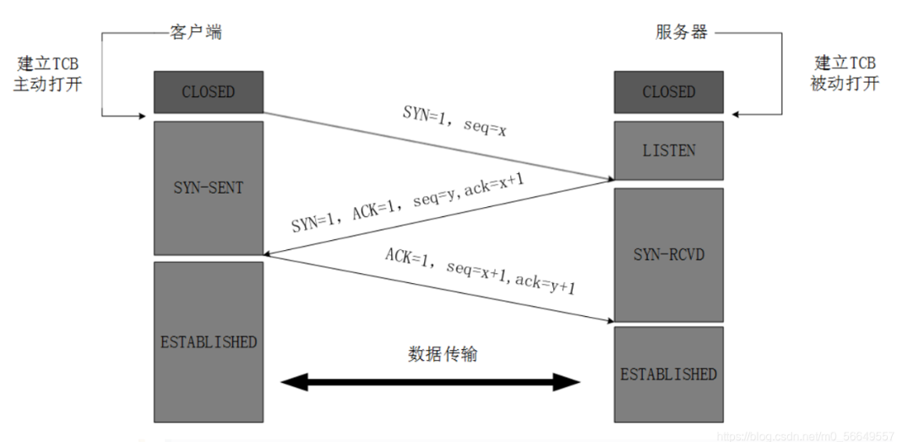
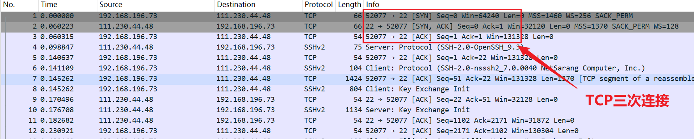
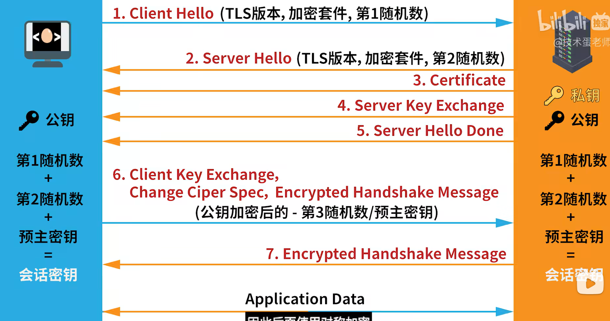
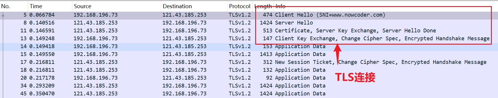
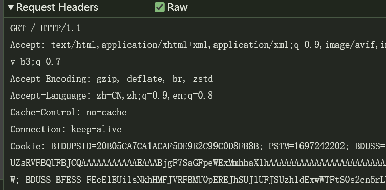
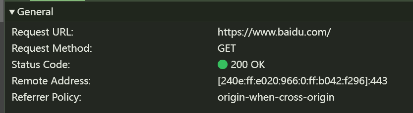
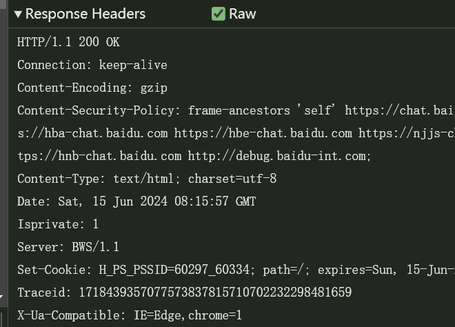

浏览器地址栏输入url到页面显示全过程

### 1. DNS解析

1. **浏览器缓存**：首先，浏览器会检查其自身的缓存中是否有该域名的IP地址。

2. **操作系统缓存**：如果浏览器缓存中没有找到，浏览器会向操作系统请求检查系统缓存。

3. **本地hosts文件**：如果系统缓存中也没有找到，操作系统会检查本地hosts文件。

4. **DNS服务器查询**：如果本地hosts文件中也没有找到，操作系统会向配置的DNS服务器（通常是ISP提供的DNS服务器）发起查询。

5. **递归查询**：DNS服务器会进行递归查询，从根DNS服务器开始，到顶级域（TLD）DNS服务器，最后到权威DNS服务器，找到该域名对应的IP地址。

   

6. **返回IP地址**：找到IP地址后，DNS服务器返回给操作系统，再返回给浏览器。

### 2. 建立连接

 	建立TCP连接（三次握手）

- **第一次握手**：客户端发送一个SYN（同步序列号）包到服务器，表示请求建立连接。

- **第二次握手**：服务器收到SYN包后，回复一个SYN-ACK（同步序列号和确认序列号）包，表示同意建立连接。

- **第三次握手**：客户端收到SYN-ACK包后，再回复一个ACK（确认序列号）包，连接建立。

  

  

  

  

​	

​	若请求的网址采用HTTPS协议，则建立完TCP连接后需要建立SSL/TLS连接

### 3. 发送HTTP请求

1. **构建请求**：浏览器构建HTTP请求，包含请求行（如GET/POST）、请求头（如User-Agent、Accept等）、请求体（POST请求）。

2. **发送请求**：浏览器将构建的HTTP请求通过已建立的TCP连接发送到服务器。

   

### 4. 服务器处理请求

1. **接收请求**：服务器接收到HTTP请求后，解析请求行、请求头和请求体。

2. **处理请求**：服务器根据请求路径和参数，调用相应的后端逻辑，处理业务逻辑，查询数据库等。

3. **生成响应**：服务器生成HTTP响应，包括响应状态码、响应头、响应体（HTML/CSS/JavaScript等资源）。

4. **发送响应**：服务器通过TCP连接将HTTP响应发送回客户端。

   

### 5. 浏览器接收响应

1. **接收数据**：浏览器接收到服务器的HTTP响应，开始解析响应头和响应体。

2. **检查状态码**：浏览器检查响应状态码，决定如何处理响应（如200表示成功，404表示未找到，500表示服务器错误等）。

   

### 6. 渲染页面

1. **解析HTML**
   - **DOM树**：浏览器解析HTML文档，构建DOM（Document Object Model）树。
   - **CSSOM树**：浏览器解析CSS样式，构建CSSOM（CSS Object Model）树。
2. **构建渲染树**：浏览器将DOM树和CSSOM树结合，构建渲染树。
3. **布局（Layout）**：浏览器计算渲染树中各个元素的位置和尺寸（布局阶段）。
4. **绘制（Paint）**：浏览器将各个元素绘制到屏幕上（绘制阶段）。
5. **合成（Composite）**：浏览器将不同的图层合成，输出到显示设备（合成阶段）。

### 7. 处理JavaScript

1. **下载JavaScript**：浏览器根据HTML中的`<script>`标签，下载JavaScript文件。
2. **解析和执行JavaScript**：浏览器解析JavaScript代码，并通过JavaScript引擎执行代码。JavaScript代码可能会修改DOM和CSSOM，从而触发重新布局和重绘。

### 8. 加载其他资源

1. **并行加载**：浏览器会并行加载页面中引用的其他资源，如CSS文件、图片、视频、字体等。
2. **缓存机制**：浏览器会使用缓存机制，尽量从本地缓存中加载资源，减少网络请求。

### 9. 完成页面渲染

当所有资源加载完成，所有JavaScript执行完毕，页面完成渲染，用户可以与页面进行交互。

### 10. 持续交互

用户与页面交互时（如点击按钮、提交表单），浏览器会根据用户操作发送新的HTTP请求，重新执行上述步骤，动态更新页面内容。