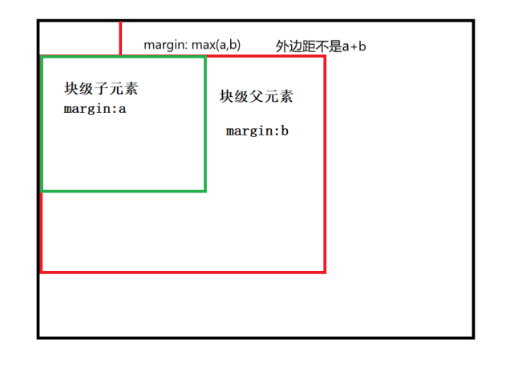

# CSS

## 盒模型

嵌套块元素垂直外边距塌陷

对于嵌套关系的块级元素若父元素和子元素同时有外边距，此时父元素会塌陷较大的外边距值，而不是将父子元素的外边距值相加

1. 父元素添加上边框
2. 父元素添加内边距
3. 父元素添加overflow: hidden




## 优先级

```css
div[class*="item"]{
    border-radius: 5px;
    background-color: aqua;
    flex: 1;
    margin: 0 5px;
}

/*要使用更具体的组合方式 如果不加.container 则优先级不够，效果无法展示*/
.container .boundary-left {
    margin-left: 0;
}
```

```html
<div class="line-one">
    <div class="one-item boundary-left">1</div>
    <div class="one-item">2</div>
    <div class="one-item">3</div>
    <div class="one-item boundary-right">4</div>
</div>
```


媒体查询样式和内联样式的优先级

```javascript
<script>
    var btn = document.querySelector(".nav-btn");
    var header = document.querySelector(".header-ul");

    btn.addEventListener("click", function (){
        console.log("click");
        header.classList.toggle('show');
        // 直接设置内联样式会清除任何由CSS媒体查询设置的样式，内联样式具有更高的优先级
        // 当调整窗口大小时，媒体查询设置的样式可能不会生效
        // if (header.style.display == "none"){
        //     header.style.display = "block";
        // }else {
        //     header.style.display = "none";
        // }
    })
</script>
```

```css
    .header-ul {
        display: none;
        padding: 0;
        margin: 0;
        list-style: none;
        text-align: center;
        color: white;
    }
    .header-ul.show {
        display: block;
    }
```

