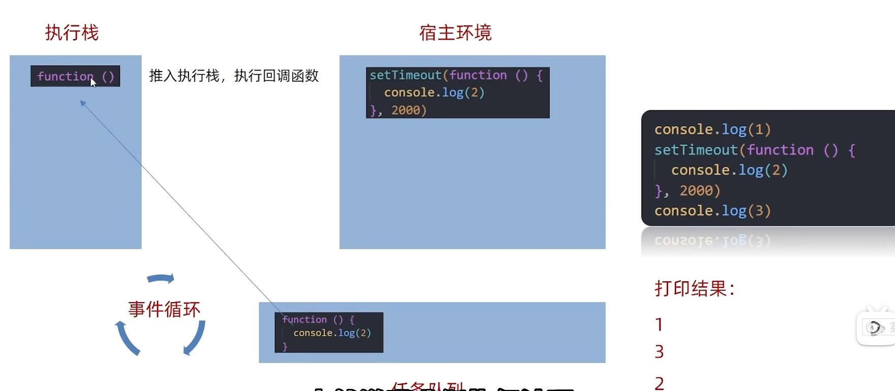
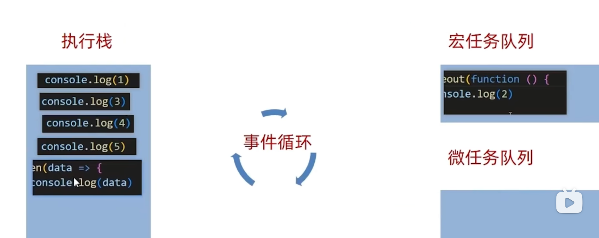
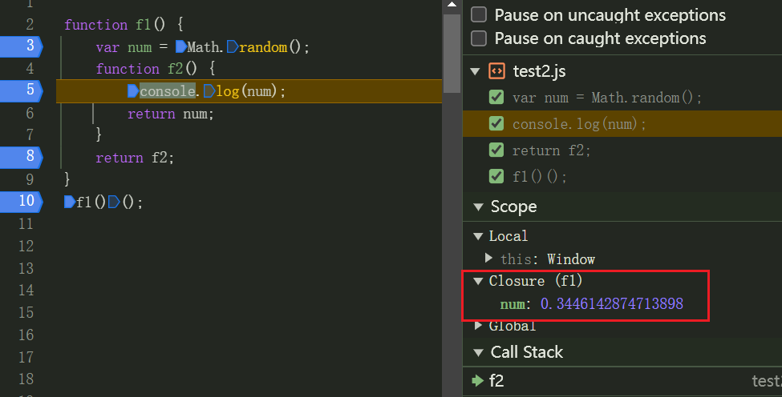
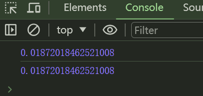
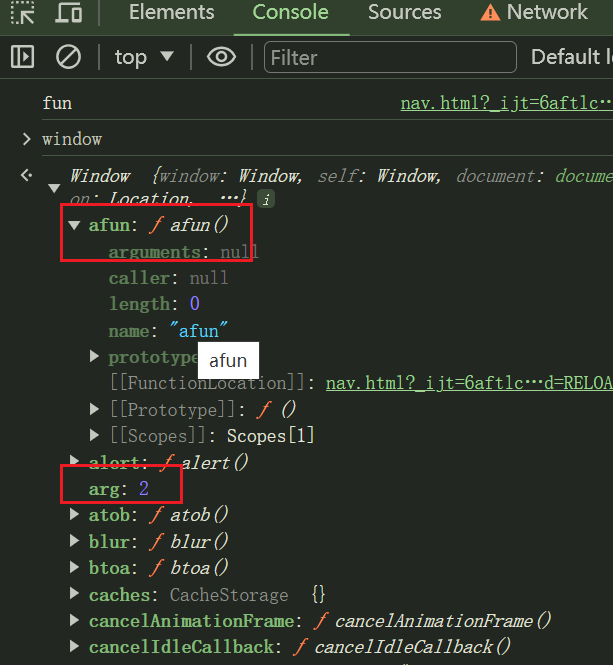
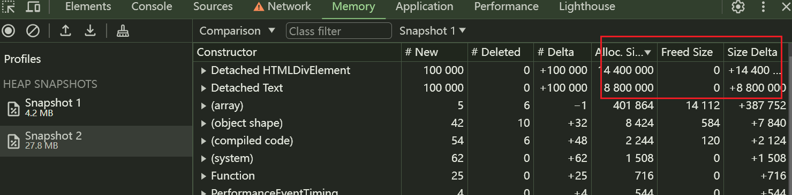

# JavaScript

## 事件循环

```javascript
// 将 console.log // ? 替换成执行顺序
debugger
let nativeConsole = console
let times = 0

console = {
  // 我为什么要这么写，作用？
  // 允许一次性输出多个参数而不需要编写多个console.log，减少代码量，易于维护
  log: (...args) => {
    // why ++times not times++ ?
    // 若为times++，则会先打印出times再加一，++times可保证times加一再打印
    nativeConsole.log.apply(null, [...args, ++times])
  },
  error: (...args) => {
    // why ++times not times++ ?
    nativeConsole.error.apply(null, [...args, ++times])
  }
}

// 把代码所在行，后面的 ? 替换成代码的执行顺序

async function async1() {
  console.log("async1 start");    // 2
  try {
    await async2();
  } catch (e) {
    console.error(e);             // 6
  }
  console.log("async1 end");      // 7
}

async function async2() {
  console.log('async2');      // 3
  throw new Error('hack1');
}

console.log("script start");  // 1

setTimeout(function () {
  console.log("settimeout");     //  9
}, 0);

try {
  async1().catch((e) => {
    console.error(e);       // ?
  });
} catch (e) {
  console.error(e);       // ?
}

new Promise(function (resolve) {
  console.log("promise1");      // 4
  resolve();
}).then(function () {
  console.log("promise2");    // 8
});

console.log('script end');      // 5

// 如何非侵入式捕获 hack1 错误
window.onerror = function (err,) {
  console.log('err', err);
};
//

```

1. 为什么执行完async2后会跳转到new Promise中？ 

2. new Promise中resolve()结束后为什么没有立刻执行后面的.then方法而是直接退出？

3. 为什么async1会捕获到异常？

4. 为什么async1捕获异常后会跳转到.then方法？

5. setTimeout在设置延迟时间为0后没有立刻执行，而是在程序的最后执行？

6. 为什么try...catch..代码块没有执行（没有捕获到错误）？



JS是单线程操作，为了防止代码阻塞，需要引入同步任务和异步任务，同步任务即程序主线程，直接放入执行栈中由JS引擎执行，异步任务由宿主环境（浏览器/node）执行。

当时机成熟时，宿主环境会将**回调函数**放入**任务队列**中，因此需要遵守先进先出的原则，当执行栈的同步任务都执行完成后，会检查任务队列是否为空，若不为空，则会见任务队列中的任务放入执行栈中执行，反复循环检查执行，这个过程就是事件循环。

setTimeout为异步任务，因此，尽管第二个参数为0，也会被放入任务队列中，等待执行栈中的任务执行完再被调用。

### 宏任务和微任务



es5之后，JS引入Promise，JS引擎也可以生成异步任务

宏任务（宿主环境）：setTimeout，setInterval，script块，I/O

微任务（JS引擎）：Promise(同步)，Promise.then()或catch()(异步)，Async/Await

程序优先执行执行栈中的同步任务，当执行栈为空时，若微任务队列不为空，则将异步任务放入执行栈中，若微任务队列为空，宏任务队列不为空，则将宏任务队列中任务放入执行栈中。

> 使用devtools的preference分析宏任务和微任务时，需要在**无痕模式**下进行，这样可以排除缓存和Cookie等数据的影响，无痕模式同时会禁用扩展和插件，模拟新用户访问网站的情况，在进行性能分析时可以提供更干净真实的测试环境。


## DOM操作

通过document获取对象时，需要将script放在HTML语句后面，因为HTML是逐行解析的，若script语句放在前面，则可能无法获取到DOM对象，或者添加defer属性。

```html
<!DOCTYPE html>
<html lang="en">
<head>
    <meta charset="UTF-8">
    <title>Title</title>
</head>
<body>
    <!--放在前面无法获取掉dom对象-->
    <!--<script src="test1.js" defer></script>-->

    <ul id="total">
        <li id="one">1</li>
        <li id="two">2</li>
        <li class="three" style="color: red">3</li>
        <li id="four">4</li>
        <li id="five">5</li>
    </ul>
    <!--放在HTML语句后面-->
    <script src="test1.js"></script>
</body>
</html>
```

```javascript
var three = document.getElementsByClassName("three");
console.log(three);

var total = document.getElementById("total");
console.log(total);

var two = document.getElementById("two" );
console.log(two);
```


## 闭包

2024-06-03

函数可以构成闭包，闭包需要满足3个特性：

1. 函数嵌套

2. 内部函数引用外部函数数据

3. 外部函数调用

通过闭包，可以实现外部函数的数据可以在其词法作用域之外使用，当调用了f2后产生了闭包，两次调用的结果相同，第一次调用，f2赋给fun，f2根据作用域链获取f1中num的引用，所以num仍存活在内存中，第二次调用，执行到f2时，根据作用域链的规则，由于第一次f2存在对num的引用，因此在f2的作用域中可以访问到num，而不需要访问f1中新生成的num，直接使用第一次的num

```javascript
function f1() {
    var num = Math.random();
    function f2() {
        console.log(num);
        return num;
    }
    return f2;
}
var fun = f1();
fun();
fun();

```






### 作用域和作用域链

JavaScript是有全局作用域，函数作用域和块作用域，简单来说就是若变量在函数体内有声明，则在整个函数体内都是有定义的

1. 全局作用域：在最外层，通过var声明的全局变量会被作为window对象的属性，作用域中的函数会被作为window对象的方法保存

   因此全局作用域的变量和函数除非在关闭网页时才会销毁，当全局作用域中存在多个变量时，会产生命名冲突，从而覆盖掉原有的变量值

   ```javascript
   <script>
       var arg = 2;
       function afun(){
           console.log("fun");
       }
       afun();
   </script>
   ```

   

   

2. 函数作用域：函数调用结束销毁，每调用一次产生一个新的作用域，相互独立

```javascript
function outer(){
    var i = 1;
    for (var j = 0; j < 5; j++){
        console.log("for内j："+j);
        if (j === 3){
            var k = 3;
            console.log("if内j："+j);     // 3
        }
        console.log("if外k的值："+k);      // undefined
    }
    console.log("for外j"+j);     // 5
}

console.log("outer外 i" + j);        // 报错 not defined
outer();
```

3. 块级作用域：使用let或const声明的变量，如果被一个大括号括住，那么这个大括号括住的变量就形成了一个块级作用域，只在当前块中生效

```javascript
{
    let num = 10;
    console.log(num);
}
console.log(num); // 报错
```


当函数调用时，若存在嵌套函数，则变量查询顺序为从内向外依次查询，词法作用域是指代码编写完成后，作用域会沿着**定义的位置**往外延伸，即遵循作用域链规则

动态作用域在运行时划分，沿着**调用栈**外外延伸


### 内存泄漏

内存泄漏指用不到的对象占据内存空间无法被回收，不能被再次利用，若不正确使用闭包，就有可能产生内存泄漏

inner2未被调用，当点击了按钮后，执行inner1，因为inner2引用了doms，所以未能被回收，产生内存泄漏

```javascript
function outer(){
    let doms = new Array(100000).fill(1);
    function inner1(){
        console.log(1);
    }
    function inner2(){
        doms;
    }
    return inner1;
}

var res ;
var btn = document.querySelector("button");
btn.addEventListener("click", ()=>{
    res = outer();
    res();
});
```




